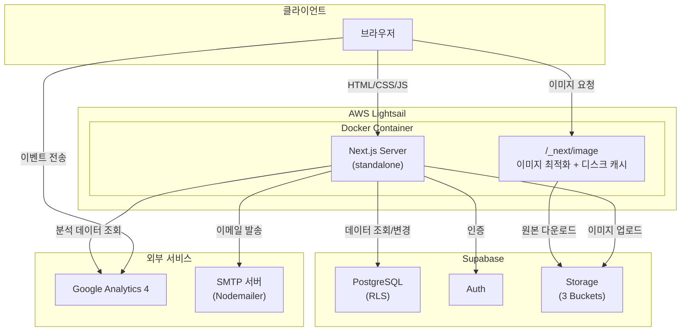

# 청소클라쓰 프론트엔드

**전주 지역 청소·이사 전문 업체 청소클라쓰 공식 웹사이트**

 

 

[**운영 사이트 바로가기**](https://www.cleaningclass.co.kr)

 

---

## 목차

- [개요](#개요)
- [기술 스택](#기술-스택)
- [시스템 아키텍처](#시스템-아키텍처)
- [주요 기능](#주요-기능)
  - [공개 사이트](#01--공개-사이트)
  - [관리자 대시보드](#02--관리자-대시보드)

---

## 개요

청소클라쓰는 전주 지역에서 청소와 이사 서비스를 제공하는 업체입니다. 본 프로젝트는 이 업체의 **공식 마케팅 웹사이트**이자 **사내 운영 시스템**으로, 방문자의 신뢰를 확보하고 견적 문의를 수집하는 공개 사이트와 실시간 분석·콘텐츠 운영을 지원하는 관리자 대시보드를 단일 Next.js 애플리케이션으로 제공합니다.

 

---

## 기술 스택

**`Core`**

**`Backend & Data`**

**`Analytics`**

**`Testing & Quality`**

**`Deploy`**

 

---

## 시스템 아키텍처

 

---

## 주요 기능

### `01` · 공개 사이트

<table>
<tr>
<td width="50%" valign="top">

#### 랜딩 & 브랜드
단일 홈페이지에 히어로, 서비스 그리드, Before/After 비교, 작업 프로세스, 블로그 리뷰, 고객 리뷰 캐러셀, FAQ, 견적 문의를 수직으로 구성하여 방문자의 의사결정 흐름을 끊김 없이 안내합니다.

</td>
<td width="50%" valign="top">

#### 서비스 소개
청소·이사 카테고리별 상세 페이지에서 Before/After 이미지와 포커스 포인트 기반 크롭을 통해 작업 품질을 직관적으로 전달합니다.

</td>
</tr>
<tr>
<td valign="top">

#### 작업 후기
블로그 리뷰를 카테고리 필터와 페이지네이션으로 탐색할 수 있는 아카이브 페이지를 제공합니다.

</td>
<td valign="top">

#### 고객 리뷰 (토큰 인증)
관리자가 발급한 1회성 토큰 URL `/review/[token]`을 통해 실제 이용 고객이 별도 로그인 없이 별점과 후기를 제출할 수 있습니다.

</td>
</tr>
<tr>
<td valign="top">

#### 견적 문의
청소/이사 유형에 따라 분기되는 Zod discriminated union 스키마로 입력을 검증하고, Nodemailer SMTP로 담당자에게 즉시 이메일을 발송합니다. 이미지 첨부도 지원합니다.

</td>
<td valign="top">

#### 정책 · RSS
개인정보처리방침, 이용약관, 도움말 FAQ 페이지를 제공하고, `/feed.xml`을 통해 서비스·리뷰 콘텐츠를 신디케이션합니다.

</td>
</tr>
</table>

 

---

### `02` · 관리자 대시보드

<table>
<tr>
<td width="50%" valign="top">

#### 분석 대시보드
GA4 Data API로 방문자, 세션, 전환 이벤트, 유입 경로를 조회해 Recharts 기반 차트로 시각화합니다.

</td>
<td width="50%" valign="top">

#### 서비스 관리
서비스 CRUD, 이미지 업로드(포커스 포인트 지정), 인라인 설명 편집을 한 화면에서 수행할 수 있습니다.

</td>
</tr>
<tr>
<td valign="top">

#### 블로그 리뷰 관리
외부 블로그 후기를 카드 형태로 큐레이션하며, 링크·태그·이미지를 리스트에서 바로 편집합니다.

</td>
<td valign="top">

#### 고객 리뷰 관리
고객이 제출한 리뷰의 공개/비공개 토글, 삭제, 신규 리뷰 제출용 1회성 토큰 발급을 제공합니다.

</td>
</tr>
<tr>
<td valign="top">

#### FAQ 관리
카테고리별 FAQ 항목을 추가·수정·삭제하고 노출 순서를 조정합니다.

</td>
<td valign="top">

#### 사이트 설정
상호, 대표 전화번호, 이메일, SNS 링크 등 전역 메타 정보를 실시간으로 편집하며, `unstable_cache`로 공개 사이트에 빠르게 반영됩니다.

</td>
</tr>
</table>

 

---

**Private** — All rights reserved.

© 청소클라쓰

